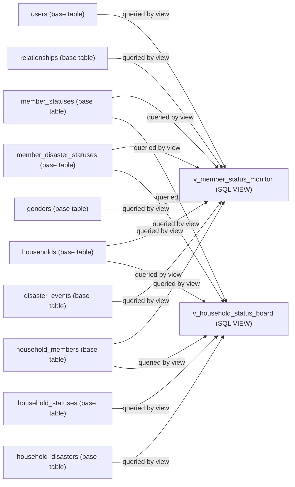

# SQL view query dependencies

These arrows reflect the actual SQL definitions, not foreign keys or ownership. They explain why the views appear disconnected in an FK-only ERD.

```mermaid
flowchart LR
    %% Query dependencies only, not foreign-key relationships.
    disasterEvents["disaster_events (base table)"]
    genders["genders (base table)"]
    householdDisasters["household_disasters (base table)"]
    householdMembers["household_members (base table)"]
    householdStatuses["household_statuses (base table)"]
    households["households (base table)"]
    memberDisasterStatuses["member_disaster_statuses (base table)"]
    memberStatuses["member_statuses (base table)"]
    relationships["relationships (base table)"]
    users["users (base table)"]
    vHouseholdStatusBoard["v_household_status_board (SQL VIEW)"]
    vMemberStatusMonitor["v_member_status_monitor (SQL VIEW)"]
    householdDisasters -->|"queried by view"| vHouseholdStatusBoard
    householdMembers -->|"queried by view"| vHouseholdStatusBoard
    householdStatuses -->|"queried by view"| vHouseholdStatusBoard
    households -->|"queried by view"| vHouseholdStatusBoard
    memberDisasterStatuses -->|"queried by view"| vHouseholdStatusBoard
    memberStatuses -->|"queried by view"| vHouseholdStatusBoard
    disasterEvents -->|"queried by view"| vMemberStatusMonitor
    genders -->|"queried by view"| vMemberStatusMonitor
    householdMembers -->|"queried by view"| vMemberStatusMonitor
    households -->|"queried by view"| vMemberStatusMonitor
    memberDisasterStatuses -->|"queried by view"| vMemberStatusMonitor
    memberStatuses -->|"queried by view"| vMemberStatusMonitor
    relationships -->|"queried by view"| vMemberStatusMonitor
    users -->|"queried by view"| vMemberStatusMonitor
```
